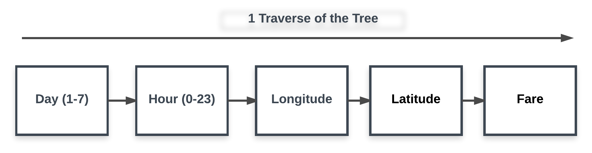
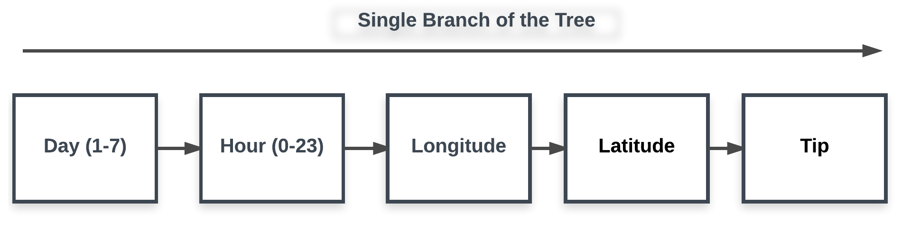

<div itemscope>
  <h2>Analysis of NYC Taxi Data</h1>
  <span><h3>Developing Models</h3></span>
</div>

In this section, we explain some modeling techniques we applied to understand the NYC Taxi data.
We applied Bootstrap method wherever possible to improve the accuracy of the results. 
The main data file has 100,000 rows, which will be randomly sampled 10,000 rows several times to improve the accuracy. 
```{r}
filename <- "sampledData100000.csv";
records  <- read.csv(filename);

if (!require(lubridate)) install.packages('lubridate')
library(lubridate)

if (!require(geosphere)) install.packages('geosphere')
library(geosphere)

if (!require(ggplot2)) install.packages('ggplot2')
library(ggplot2)
```

<div id="bg">
  
</div>

<span><h3>
2.a) In what trips can you confidently use respective means as measures of central tendency to estimate fare, time taken, etc.
</h3></span>

In statistics, the measures of central tendencies are Mean, Median, Mode, etc. For example, if a sample is close to Mean of the population mean, then that sample can represent the population with high confidence level. However, analyzing the entire population is not possible.

The Central Limit Theorem states that the sampling distribution of the sampling means approaches a normal distribution as the sample size gets larger and typically over 30. Further, the mean of the distribution of the sample mean is closer to the population mean.

Therefore, we should select trips where their features sampling means are a normal distribution. However, this is only for representation. To increase the confidence, the values of the sample features should be closer to the mean of the sample mean distribution.

To demonstrate this, we selected Fare feature. We randomly picked 10000 samples 100 times from 100,000 data set. Then we plotted the distribution of the mean of the sample fare set. 

```{r}
maxItter <- 100
numSamples <- 10000

meanFareDistribution <- array(maxItter)
for (i in c(1:maxItter)){
  sampleData <- records[sample(1:nrow(records), numSamples, replace=FALSE),]
  
  requestedData <- sampleData$fare_amount
  meanFareDistribution[i] <- mean(requestedData)
}
hist(meanFareDistribution)
summary(meanFareDistribution)
```

As per the distribution summary, the mean of the distribution of the means is ~12.3 dollars. Then we can say, the trips having fare closer to 12.3 dollars represent the central tendency respective to the fare. This might not be true related to a different feature.

<div id="bg">
  
</div>

<span><h3>
2.b)	Can we build a model to predict fare and tip amount given pick up and drop off coordinates, time of day and week?
</h3></span>

First of all we prepared the data for the model. Here we extracted the day of the week and hour of the day from the pickup_datetime. We created lmData data frame for processing. It has fare, pickLat , pickLon , dropLat , dropLon , day , hour.
```{r}
lmData  <- data.frame(fare=records$fare_amount, tip=records$tip_amount, tripDuration=records$trip_time_in_secs, 
                      pickLat=records$pickup_latitude,pickLon=records$pickup_longitude, 
                      dropLat=records$dropoff_latitude,dropLon=records$dropoff_longitude,
                      day=wday(records$pickup_datetime), hour=hour(records$pickup_datetime))
```

Then we cleaned the data. For that we plotted the distribution of each.
```{r}
attach(mtcars)
par(mfrow=c(3,3)) 
hist(lmData$fare)
hist(lmData$pickLat)
hist(lmData$pickLon)
hist(lmData$dropLat)
hist(lmData$dropLon)
hist(lmData$day)
hist(lmData$hour)
```

Those data are not properly distributed for modelling. Data has high skewness. We are now cleaning and transforming the data for proper distribution. Otherwise, the outliers will impact on the model.

We remove wrong GPS locations which are clearly data entry errors. We also removed trips having same pickup and dropoff locations. We then forcus on the high taxi demand areas by limiting the GPS coordinates. Since fare has high variation, we forcus on the most consistent fares as very high fare from a single trip is rare.
```{r}
lmData <- lmData[lmData$fare<20, ]
lmData <- lmData[lmData$pickLat < 40.85 & lmData$pickLat > 40.65, ]
lmData <- lmData[lmData$dropLat < 40.85 & lmData$dropLat > 40.65, ]
lmData <- lmData[lmData$pickLon < -73.93 & lmData$pickLon > -74.02, ]
lmData <- lmData[lmData$dropLon < -73.93 & lmData$dropLon > -74.02, ]
lmData <- lmData[lmData$pickLat!=lmData$dropLat & lmData$pickLon!=lmData$dropLon, ]

attach(mtcars)
par(mfrow=c(3,3)) 
hist(lmData$fare)
hist(lmData$pickLat)
hist(lmData$pickLon)
hist(lmData$dropLat)
hist(lmData$dropLon)
hist(lmData$day)
hist(lmData$hour)
```

Now we focus on the data related to Tip. First, let's study the distribution of the Tip.
```{r}
hist(lmData$tip)
```

It seems the Tip is highly right skewed. Further, most tips are 1 dollar tips. Here we assume we want to predict tips greater than 1 dollar as having a 1 dollar tip is very common. We selected the most consistent tips other than 1 dollar. Then we applied log function to transform the Tip closer to normal distribution. We identified this transformation to transform the distribution closer to normal. Another advantage of applying log function to deskew the distribution is that reverse transformation is straightforward and easy. The new distribution of the Tip is as follows:
```{r}
attach(mtcars)
lmData <- lmData[lmData$tip<10 & lmData$tip>1, ]
lmData$logTip <- log(lmData$tip);
hist(lmData$logTip)
```

<div id="bg">
  
</div>

Now data are ready for modeling. First, start with the fare. Let's run a linear model and summarize the results.
Note here we run the modeling process 100 times to improve the reliability.
```{r}
maxItter <- 100
numSamples <- 10000

modelFareDistribution <- array(maxItter)
for (i in c(1:maxItter)){
  
  lmDataSampled <- lmData[sample(1:nrow(lmData), numSamples, replace=FALSE),]
  
  myModelFare  <- lm(fare ~ pickLat + pickLon + dropLat + dropLon + day + hour, data=lmDataSampled)
  modelFareDistribution[i] <- summary(myModelFare)$r.squared
}
summary(myModelFare)
hist(modelFareDistribution)
```

Using the summary of the linear model, we can see that day and hour are not significant parameters for this model. Further R-squared is around low which is not good. R-squared is defined as:  

R-squared = 1 - (sum((actual-predict )^2)/sum((actual-mean(actual))^2)),  

Where closer to 1 is desirable.  
  
Now I would like to check whether there is a relationship between fare and day of the week, and fare and hour of the day.
```{r}
attach(mtcars)
par(mfrow=c(3,3)) 
requestedData <- lmData[lmData$day==1,]
hist(requestedData$hour)
requestedData <- lmData[lmData$day==2,]
hist(requestedData$hour)
requestedData <- lmData[lmData$day==3,]
hist(requestedData$hour)
requestedData <- lmData[lmData$day==4,]
hist(requestedData$hour)
requestedData <- lmData[lmData$day==5,]
hist(requestedData$hour)
requestedData <- lmData[lmData$day==6,]
hist(requestedData$hour)
requestedData <- lmData[lmData$day==7,]
hist(requestedData$hour)
```

As per the histograms, we can see that there is a pattern depending on the day of the week. Weekdays have similar pattern while the weekends are different. Therefore, we cannot generalize the weekdays and weekends. On the other hand, the fare has a non-linear pattern with the hour of the day.  
  
Therefore, we remove day and hour variables from the linear model. Then we categorized the fare and GPS locations (pickup and drop-off) based on the day and hour.   
  
Now let's check the linear model again without day and hour. Note that we randomly selected the day and hour for this testing.
```{r}
maxItter <- 100
numSamples <- 10000

modelFareDistribution <- array(maxItter)
requestedDay  = floor(runif(1, 1, 7));
requestedHour = floor(runif(1, 0, 23));
for (i in c(1:maxItter)){
  lmDataSampled <- lmData[sample(1:nrow(lmData), numSamples, replace=FALSE),]
  
  requestedData <- lmDataSampled[lmDataSampled$day==requestedDay & lmDataSampled$hour==requestedHour, ]
  
  myModelFare <- lm(fare ~ pickLat + pickLon + dropLat + dropLon, data=requestedData)
  modelFareDistribution[i] <- summary(myModelFare)$r.squared
}
summary(myModelFare)
hist(modelFareDistribution)
```

The accuracy of the model is still not desirable. It seems linear modeling is not working with these parameters.
Then I checked the correlation between the fare and other independent variables. It seems the correlation is very low. Therefore, linear modeling is difficult.

```{r}
cor(lmDataSampled$fare, lmDataSampled$day)
cor(lmDataSampled$fare, lmDataSampled$hour)
cor(lmDataSampled$fare, lmDataSampled$pickLat)
cor(lmDataSampled$fare, lmDataSampled$pickLon)
cor(lmDataSampled$fare, lmDataSampled$dropLat)
cor(lmDataSampled$fare, lmDataSampled$dropLon)
```

As an alternation, we decided to implement decision tree. The idea is as follow.
<div id="bg">
  
</div>
We build a tree as above. The model will run many times and calculate the average of the fare. Once the tree is constructed, we can use it to predict the unknown fare based on the date, hour and coordinates.

```{R}
numSamples  <- 10000
#resGPS     <- 100
resGPS      <- 10
numDigitGps <- 3

seqPickLat <- seq(40.65, 40.85, length.out = resGPS)
seqPickLon <- seq(-74.02, -73.93, length.out = resGPS)
seqDropLat <- seq(40.65, 40.85, length.out = resGPS)
seqDropLon <- seq(-74.02, -73.93, length.out = resGPS)
seqDay     <- seq(1, 7, length.out = 7)
seqHour    <- seq(0, 23, length.out = 24)

nycModelFare <- array(0,dim=c(resGPS,resGPS,resGPS,resGPS,7,24,2))

lmDataSampled <- lmData[sample(1:nrow(lmData), numSamples, replace=FALSE),]

for (n in 1:numSamples){
    i <- match(round(lmDataSampled$pickLat[n], digits = numDigitGps), round(seqPickLat, digits = numDigitGps))       
    j <- match(round(lmDataSampled$pickLon[n], digits = numDigitGps), round(seqPickLon, digits = numDigitGps))    
    p <- match(round(lmDataSampled$dropLat[n], digits = numDigitGps), round(seqDropLat, digits = numDigitGps))   
    q <- match(round(lmDataSampled$dropLon[n], digits = numDigitGps), round(seqDropLon, digits = numDigitGps))
    u <- match(lmDataSampled$day[n], seqDay)
    v <- match(lmDataSampled$hour[n], seqHour)
    
    if (!is.numeric(i*j*p*q*u*v)){next}
  
    nycModelFare[i,j,p,q,u,v,1] <- nycModelFare[i,j,p,q,u,v,1] + lmDataSampled$fare[n]
    nycModelFare[i,j,p,q,u,v,2] <- nycModelFare[i,j,p,q,u,v,2] + 1;
}
```

<div id="bg">
  
</div>

The same method which is used to model the fare is used for model the Tip. Following diagram show single branch of the tree.
<div id="bg">
  
</div>

```{R}
numSamples  <- 10000
#resGPS     <- 100
resGPS      <- 10
numDigitGps <- 3

seqPickLat <- seq(40.65, 40.85, length.out = resGPS)
seqPickLon <- seq(-74.02, -73.93, length.out = resGPS)
seqDropLat <- seq(40.65, 40.85, length.out = resGPS)
seqDropLon <- seq(-74.02, -73.93, length.out = resGPS)
seqDay     <- seq(1, 7, length.out = 7)
seqHour    <- seq(0, 23, length.out = 24)

nycModelTIP <- array(0,dim=c(resGPS,resGPS,resGPS,resGPS,7,24,2))

lmDataSampled <- lmData[sample(1:nrow(lmData), numSamples, replace=FALSE),]

for (n in 1:numSamples){
    i <- match(round(lmDataSampled$pickLat[n], digits = numDigitGps), round(seqPickLat, digits = numDigitGps))       
    j <- match(round(lmDataSampled$pickLon[n], digits = numDigitGps), round(seqPickLon, digits = numDigitGps))    
    p <- match(round(lmDataSampled$dropLat[n], digits = numDigitGps), round(seqDropLat, digits = numDigitGps))   
    q <- match(round(lmDataSampled$dropLon[n], digits = numDigitGps), round(seqDropLon, digits = numDigitGps))
    u <- match(lmDataSampled$day[n], seqDay)
    v <- match(lmDataSampled$hour[n], seqHour)
    
    if (!is.numeric(i*j*p*q*u*v)){next}
  
    nycModelTIP[i,j,p,q,u,v,1] <- nycModelTIP[i,j,p,q,u,v,1] + lmDataSampled$tip[n]
    nycModelTIP[i,j,p,q,u,v,2] <- nycModelTIP[i,j,p,q,u,v,2] + 1;
}
```

<div id="bg">
  
</div>
  
